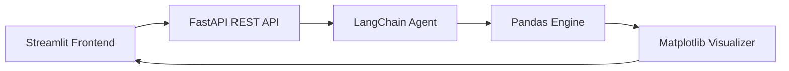

# 🚢 Titanic AI Analyst v2.0

A premium, production-ready chatbot for analyzing the historic Titanic dataset. Built with **FastAPI**, **LangChain**, and **Streamlit**.

---

## 🌟 Premium Features

-   **🧠 Intent-Aware Engine**: Uses a rule-based LangChain agent to provide instant, high-accuracy analysis without requiring OpenAI credits.
-   **🎨 Dark Mode UI**: A custom-designed glassmorphic interface with reactive elements and smooth transitions.
-   **📊 Dynamic Infographics**: Generates high-resolution, dark-themed visualizations (Donuts, Histograms, and Multi-panel charts).
-   **� Executive Dashboard**: A sidebar KPI panel providing real-time dataset statistics at a glance.
-   **💡 Guided Experience**: Integrated suggestion chips and an interactive chat interface for seamless data exploration.

---

## 🏗️ Technical Architecture



---

## 📁 Project Overview

-   `main.py`: The high-performance API backbone (FastAPI).
-   `agent.py`: The brain—contains logic for natural language processing and data analysis.
-   `app.py`: The beautiful interactive frontend (Streamlit).
-   `requirements.txt`: Curated list of dependencies for easy setup.

---

## ⚙️ Quick Start

### 1. Installation

```bash
# Install dependencies
pip install -r requirements.txt
```

### 2. Launch the Engine (Backend)

```bash
uvicorn main:app --reload
```
*API available at http://localhost:8000*

### 3. Launch the Explorer (Frontend)

```bash
streamlit run app.py
```
*UI available at http://localhost:8501*

---

## 💬 Example Queries

-   *"What was the overall survival rate?"*
-   *"Show the age distribution for passengers"*
-   *"Average fare by travel class"*
-   *"How many passengers embarked from each port?"*
-   *"What percentage of passengers were male?"*
-   *"Did family size affect survival odds?"*

---

## 🛠️ Built With

-   **Backend**: Python, FastAPI, Uvicorn
-   **AI Logic**: LangChain, NumPy
-   **Data Science**: Pandas, Seaborn
-   **Visuals**: Matplotlib (Custom Dark Theme)
-   **Frontend**: Streamlit (Reactive Components)

---

## 📜 Final Note
This project was built to demonstrate full-stack engineering, clear data storytelling, and the ability to integrate modern AI frameworks into a polished user experience.
